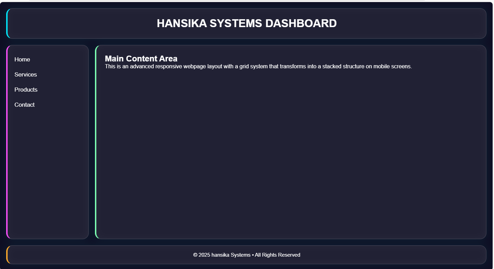

Basic Blog Post Layout – HTML Project
This project contains a simple HTML blog post layout created as part of Task 1.
The goal is to design a clean blog page using semantic HTML tags.

TASK REQUIREMENTS
Create a single HTML file for a blog post
Includes
->Title
->Publication date
->Author name
->Introduction section
->Main content section with a list
->Conclusion section
->At least one image
->A "Read More" link

WHAT THIS PROJECT CONTAINS
index.html – the main blog post file created using semantic HTML
Basic styling inside the HTML (optional to separate later)

TECHNOLOGIES USED
HTML5

PRODUCT IMAGE

